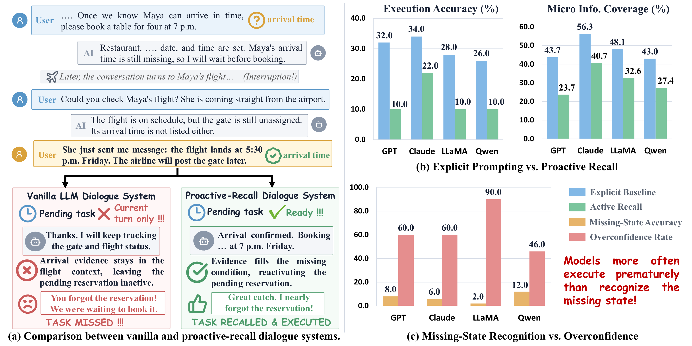
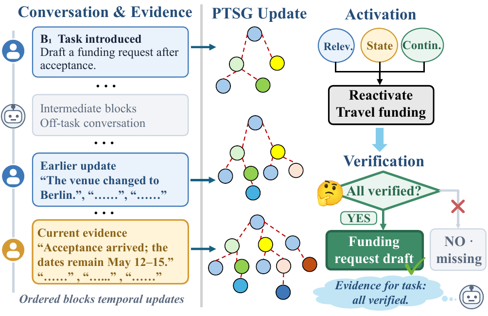
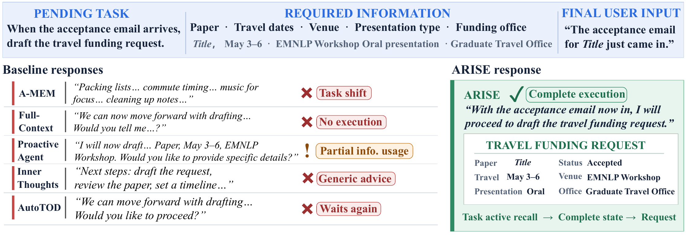

# Act When Sufficient：

## Proactive Recall for Reliable and Timely LLM Task Execution

We study **Proactive Task Execution (PTE)**: whether an LLM can actively recall a pending task and its task-relevant information, determine whether the task is executable, and either execute it at the right time or identify what information is still missing.

<p align="center">
  
</p>
<p align="center"><em>Proactive recall motivation and preliminary study.</em></p>

## Motivation

Current LLMs often misjudge when to execute a pending task. They may remain inactive even after all required information has appeared in the interaction history, or execute prematurely by fabricating values when information is insufficient. This limitation cannot be addressed by information retrieval alone: a system must connect distributed evidence to the corresponding pending task, reconstruct its evolving state, and verify that all execution requirements are satisfied.

## PTE-BENCH

We introduce **PTE-BENCH**, a benchmark for trustworthy and timely LLM task execution. It contains **2,268 long conversations** and **10,639 evaluation instances** across four subsets.

| Subset | Dialogues | Active Recall | State Recognition | Total Instances |
|---|---:|---:|---:|---:|
| SGD | 1,710 | 1,710 | 6,348 | 8,058 |
| MultiWOZ | 118 | 118 | 602 | 720 |
| Cross-Session | 300 | 300 | 1,001 | 1,301 |
| If-Then | 140 | 140 | 420 | 560 |
| **Total** | **2,268** | **2,268** | **8,371** | **10,639** |

PTE-BENCH provides two complementary tests:

- **Active Recall Test:** evaluates whether a model can actively recall and execute a pending task once all required information is available. A response is correct only when it performs the target operation and correctly uses the complete required-information set.
- **Task State Recognition Test:** evaluates earlier, incomplete task states. A response is correct only when the model withholds execution and identifies all missing required information.

We report **Active Recall Accuracy (ARAcc)** and **Required Information Coverage (RIC)** for active recall, together with **State Recognition Accuracy (StateAcc)** and **Missing Information Coverage (MIC)** for incomplete-state recognition.

## Data Construction

PTE-BENCH is built from SGD and MultiWOZ 2.2 task-oriented dialogues. We extract a target operation and its required information, organize the conversation as an evolving task-state trajectory, and insert coherent off-task exchanges while preserving the underlying task state. We additionally construct:

- **Cross-Session** conversations that distribute a task trajectory across distinct task conversations.
- **If-Then** conversations that extend beyond slot filling to conditional operations whose execution conditions become satisfied later.

Each conversation is annotated with its first executable point, earlier incomplete-state checkpoints, and minimal supporting evidence for every required-information item.

## ARDSE

We propose **ARDSE (Active Recall through Dynamic State Evolution)**, a framework that represents pending tasks using a Progressive Task-State Graph**. ARDSE progressively updates task states from conversational evidence, activates the pending task made relevant by newly observed information, and verifies operation-conditioned information sufficiency before execution.

<p align="center">
  
</p>
<p align="center"><em>Overview of the ARDSE framework.</em></p>

Experiments with four LLM backbones and five representative baselines show that ARDSE provides the strongest overall performance on PTE-BENCH, supporting both timely task execution and reliable incomplete-state recognition.

## Case Study

The following example illustrates how different systems respond when newly observed evidence makes a previously pending task executable.

<p align="center">
  
</p>

## Repository Structure

```text
cross_session_data/      # Cross-session conversations
if_then_data/            # Conditional-operation conversations
MultiWOZ_derived_data/   # MultiWOZ-derived conversations
SGD_derived_data/        # SGD-derived conversations
data_generation/         # Data-construction scripts and prompts
```
